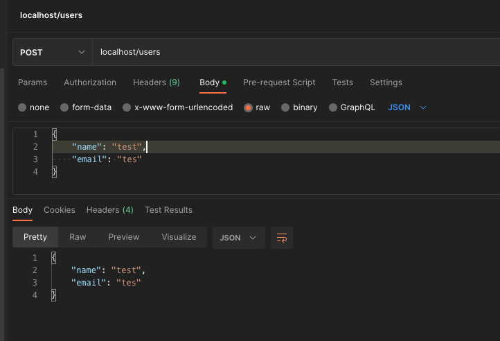

# Python Fast API

By Gustavo Morais, Zend Certified PHP Engineer


### Doc link
```
https://fastapi.tiangolo.com/tutorial/
```

```bash

docker-compose up -d --build
docker exec -it pystd sh

pip install uvicorn[standard] # Uvicorn is an ASGI web server implementation for Python. https://www.uvicorn.org/
pip install "fastapi[all]"

# run this command at the computer terminal to allow the container buil gui windows
sudo xhost + 
```

### Run aplication
```
uvicorn main:app --reload --host=0.0.0.0
```

### Routes
GET http://localhost/url-query/?id=2
<br>
GET http://localhost/docs
<br>
GET http://localhost/validations/?q=111
<br>


